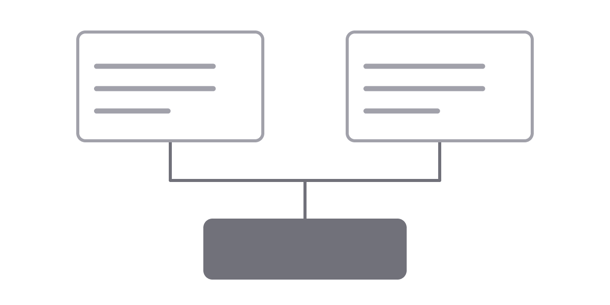

Chép thư mục này để bắt đầu một bài mới. Tên thư mục chính là slug và cũng là
URL, nên giữ nó ở dạng ASCII kebab-case.

Ba file quan trọng. `post.yaml` giữ những gì hai ngôn ngữ dùng chung — ngày
đăng, tag, và ngôn ngữ viết trước. `en.md` và `vi.md` giữ phần chữ; mỗi file chỉ
mang tiêu đề và mô tả của riêng nó.

```java
public record Greeting(String text) {
    public static Greeting of(String name) {
        return new Greeting("Hello, " + name);
    }
}
```

Mọi tag dùng ở đây phải có sẵn trong `content/tags.yaml`. Tag chưa khai sẽ làm
build đỏ và nêu đúng tên nó, thay vì lọt lên production trong im lặng.

```yaml
spring-boot:
  en: "Spring Boot"
  vi: "Spring Boot"
```

Ảnh nằm trong thư mục `assets/` của chính bài đó, viết bằng đường dẫn tương đối.
Hai ngôn ngữ trỏ về cùng một file — một tấm ảnh, không phải mỗi thứ tiếng một
bản.



Script dịch không bao giờ để model nhìn thấy code hay đường dẫn. Khối code, đoạn
code giữa dòng, đường dẫn ảnh, URL của link và thuộc tính `src` đều được rút ra
trước khi gửi đi và ghép lại nguyên xi, nên chúng giống hệt nhau ở cả hai file.
Alt text là ngoại lệ, và cố tình như vậy: nó là câu chữ mà screen reader đọc to
lên, nên nó được dịch như mọi câu khác.
