Turning on DNSSEC for this domain took two lines of Terraform. Then Cloudflare
handed me a line to type into Namecheap by hand:

```text
vulinh.dev. 3600 IN DS 2371 13 2 D5C70F86555DE9975775DC154D7C3060B78C1CA240F6BD39B90709FBCC69C3E2
```

Four values, no explanation. Typing numbers into a registrar's form without knowing
what they mean is how people break their own domain, so I went and found out.
This is what each one is, and how to check that Cloudflare did not simply make
them up.

## What DNSSEC signs, and what it does not

A plain DNS answer carries no signature. Your resolver asks where `vulinh.dev`
lives, something answers, and there is no way to tell whether that something was
the authoritative server or a stranger on the path. Poison a resolver's cache
and every user behind it goes to your machine until the fake record expires.

DNSSEC signs each record. The resolver checks the signature and throws the
answer away when it does not match. That buys authenticity and integrity — the
answer came from the right server and arrived unaltered.

It does not buy privacy. DNSSEC is a signature, not an envelope. Anyone watching
the wire still sees which names you look up; hiding that needs DNS over HTTPS or
DNS over TLS, which are different protocols solving a different problem.

## The chain, and the link that was missing

Nobody is trusted alone. Each level vouches for the one below it:



Resolvers ship with the root's key built in — the trust anchor — and walk down
from there. Cloudflare had already signed my zone and published the keys:

```bash
dig +short DNSKEY vulinh.dev @8.8.8.8
```

```text
256 3 13 oJMRESz5E4gYzS/q6XDrvU1qMPYIjCWzJaOau8XNEZeqCYKD5ar0IRd8KqXXFJkqmVfRvMGPmM1x8fGAa2XhSA==
257 3 13 mdsswUyr3DPW132mOi8V9xESWE8jTo0dxCjjnopKl+GqJxpVXckHAeF+KkxLbxILfDLUT0rAK9iUzy1L53eKGQ==
```

Two keys, and the leading numbers say why. The `flags` field is read bit by bit:
bit `256` means the key signs DNS records, and bit `1` marks it as the secure
entry point that a DS record points at. So `257` is the Key Signing Key and
`256` is the Zone Signing Key. The ZSK signs everyday records and rotates often.
The KSK signs only the ZSK, and rotates rarely — because every rotation means
retyping a DS record at the registrar. The `3` in the middle is the protocol
field. It is always `3` and carries no information.

But `.dev` was not vouching for me yet:

```bash
dig +short DS vulinh.dev @8.8.8.8
```

```text
(empty)
```

That empty line is the whole job. The DS record has to live in the parent zone,
because a record that vouches for a zone is worthless if it sits inside the zone
it vouches for — forge the zone and you forge the endorsement with it.

## The four numbers


**`2371` is the key tag.** A 16-bit checksum computed from the key itself. Not
secret, not random, and not guaranteed unique. When a zone publishes several
keys, a resolver uses the tag to guess which one to try first instead of trying
all of them. Two keys can collide, and nothing breaks — the resolver just tries
both. Think of the last four digits of a phone number: enough to narrow a search,
not enough to identify anyone.

**`13` is the algorithm.** A code from IANA's registry, not a number somebody
chose. `8` is RSA with SHA-256, which the root uses to sign `.dev`. `13` is
ECDSA P-256 with SHA-256, which Cloudflare uses because an ECDSA key is around
four times smaller than an RSA one at comparable strength. Smaller keys mean
responses that still fit in a UDP packet instead of falling back to TCP, which
is faster and gives amplification attacks less to work with.

**`2` is the digest type**, also from an IANA registry. `1` is SHA-1 and is
obsolete. `2` is SHA-256 and is what everyone uses now.

**`D5C70F86...` is the digest**, and it is the point of the whole mechanism. The
`.dev` registry does not hold my KSK. It holds a fingerprint of it. When a
resolver asks, `.dev` hands over the fingerprint, the resolver hashes the KSK
that `vulinh.dev` publishes, and compares. A passport office does not keep your
finger; it keeps a picture of the print, and the border scanner compares.



## Computing the DS yourself

Cloudflare generates the key pair. That is the only place randomness enters. The
DS record is then *derived* from the public key by a formula in RFC 4034, which
means anyone can recompute it — including me, before typing it into a form that
can take my domain offline:

```python
import base64, hashlib

# Exactly what Cloudflare publishes for the zone, read with:
#   dig +short DNSKEY vulinh.dev @8.8.8.8
FLAGS      = 257          # 257 = Key Signing Key
PROTOCOL   = 3            # always 3
ALGORITHM  = 13           # ECDSA P-256 with SHA-256
PUBLIC_KEY = "mdsswUyr3DPW132mOi8V9xESWE8jTo0dxCjjnopKl+GqJxpVXckHAeF+KkxLbxILfDLUT0rAK9iUzy1L53eKGQ=="

# DNSKEY RDATA: flags | protocol | algorithm | public key
rdata = (
    FLAGS.to_bytes(2, "big")
    + bytes([PROTOCOL, ALGORITHM])
    + base64.b64decode(PUBLIC_KEY)
)

# Owner name in DNS wire format: length-prefixed labels, null terminated
owner = b"\x06vulinh\x03dev\x00"

# DS digest = SHA-256(owner name || DNSKEY RDATA), RFC 4034 section 5.1.4
digest = hashlib.sha256(owner + rdata).hexdigest().upper()

# Key tag, RFC 4034 appendix B
ac = 0
for i, b in enumerate(rdata):
    ac += b if (i & 1) else (b << 8)
ac += (ac >> 16) & 0xFFFF
key_tag = ac & 0xFFFF

print("computed key tag :", key_tag)
print("computed digest  :", digest)
```

```text
computed key tag : 2371
computed digest  : D5C70F86555DE9975775DC154D7C3060B78C1CA240F6BD39B90709FBCC69C3E2

cloudflare said  : DS 2371 13 2 D5C70F86555DE9975775DC154D7C3060B78C1CA240F6BD39B90709FBCC69C3E2
```

Character for character. That thirty-line script is also, more or less, what
every validating resolver on the internet does with my zone.

It has a practical consequence too. Rotate the KSK and both the tag and the
digest change, so the DS has to be retyped at the registrar. That is why the KSK
sits still while the ZSK rotates freely.

## Order matters, and getting it wrong is expensive

```text
1. Cloudflare signs the zone and publishes DNSKEY
2. Enter the DS at the registrar
3. The DS propagates to the .dev registry
4. Cloudflare flips the zone from pending to active
```

Do step 2 before step 1 and resolvers start demanding a signature the zone
cannot produce. They do not shrug and carry on. They return `SERVFAIL`, which
means the domain does not resolve at all — for everyone whose resolver validates
DNSSEC, `8.8.8.8` included.

That is a nasty failure to diagnose, because it is not total. The site keeps
working for people on non-validating resolvers and vanishes for everybody else,
which looks like almost anything except a DNS problem.

Meanwhile `tofu plan` kept reporting drift:

```text
~ status = "pending" -> "active"
```

That is not a bug to chase. Cloudflare cannot flip the status on its own; it
waits for the parent registry. The plan stops reporting drift once the DS lands
and propagates. Worth asking, before fixing a pending state: what is it waiting
for, and is that thing mine to do?

## Why a static blog bothers

Fair question. There is no login here and the content is public.

The strongest reason is certificate issuance. A Certificate Authority proves you
own a domain mostly through DNS — it asks you to publish a TXT record and then
looks it up. Someone who can forge your DNS answers can pass that check and be
issued a genuine certificate for your domain. At that point HTTPS protects
nobody: the browser shows a normal padlock, because the certificate is real.

CAA records limit which authorities may issue for a domain, but a CAA record is
just another DNS record and is forgeable too. DNSSEC is what makes CAA mean
something.

The honest summary: DNSSEC is not stopping an attack on this blog today. It is
cheap insurance against a rare failure that is very hard to undo — losing
control of the domain's identity. Two lines of Terraform, one form at the
registrar, free at Cloudflare. At that price it does not need a dramatic
justification.

## Checking it worked

```bash
dig +dnssec vulinh.dev @8.8.8.8 | grep -oE 'flags: [a-z ]+'
```

```text
flags: qr rd ra ad
```

The `ad` flag stands for authenticated data, and it is the proof that matters.
It means the resolver walked the chain from the root down, checked every
signature, and found them all valid.

Two other things I took away from this. Numbers in network protocols are mostly
registry lookups, not arbitrary choices — meeting a strange one, go find which
IANA registry it belongs to instead of guessing. And a few manual steps are
fine. Entering that DS record happens once in a domain's life. Automating it
would mean another API credential and another provider to save two minutes.
Writing the boundary down where the next person finds it is enough.

## Sources

- [Cloudflare — DNSSEC](https://developers.cloudflare.com/dns/dnssec/)
- [RFC 4034 — Resource Records for DNSSEC](https://datatracker.ietf.org/doc/html/rfc4034), where the digest and key tag formulas live
- [IANA — DNSSEC Algorithm Numbers](https://www.iana.org/assignments/dns-sec-alg-numbers/dns-sec-alg-numbers.xhtml)
- [IANA — DS Digest Types](https://www.iana.org/assignments/ds-rr-types/ds-rr-types.xhtml)
- <https://dnsviz.net/> draws the whole chain of trust for a domain, which is the fastest way to see where a broken one snapped

Everything above is a public DNS record. You can read this domain's keys with
`dig` yourself: https://dnsviz.net/d/vulinh.dev/dnssec/
